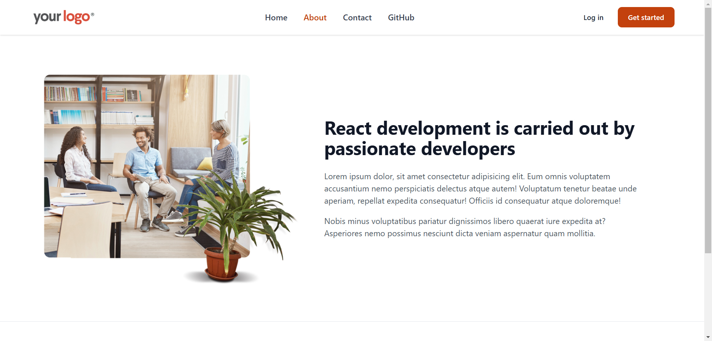

# React Router
Hi, this repository contains a React app that demonstrates the use of react-router-dom for building multi-page navigation within a single-page application (SPA). This project showcases core features of react-router-dom, including routing, navigation, and parameter handling, making it an ideal example for understanding and implementing client-side routing in React.

Built with:

  

## Output:

